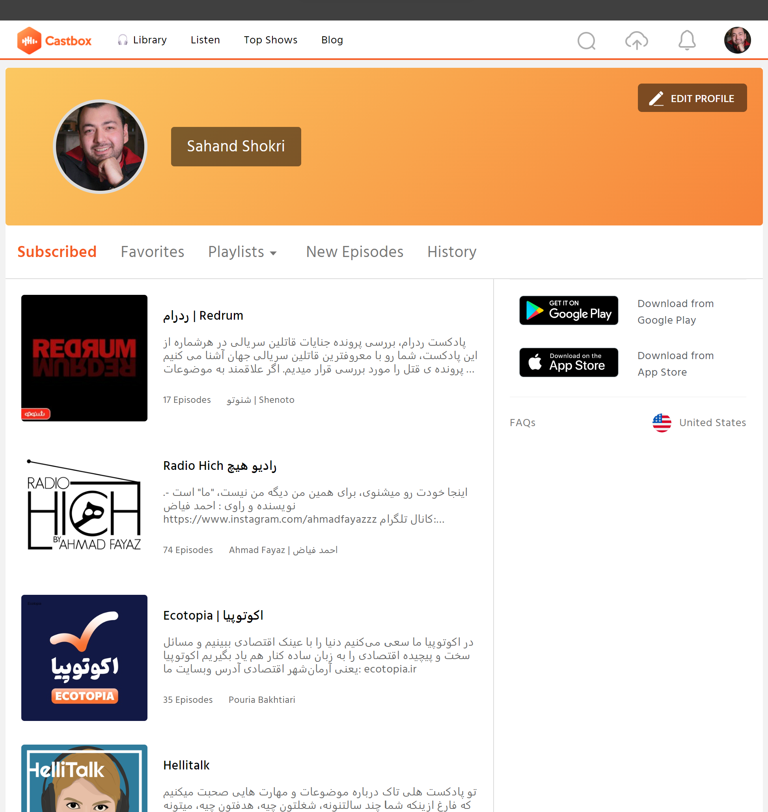
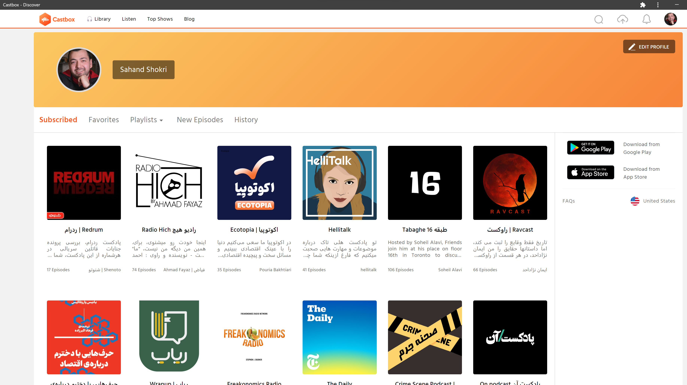

# Castbox Chrome Extension - Mobile Design Restyler

Welcome to the Castbox Chrome Extension repository! This extension tries to transform the Castbox web app **Subscribed** page into the familiar and user-friendly design of its mobile app counterpart.

## Before and After Comparison

*Before: Original Castbox Subscribed Web Interface*

*After: Castbox Chrome Extension Modified Version*

## Getting Started

To get started with the Castbox Chrome Extension, follow these steps:

1. Clone this repository: `git clone https://github.com/sahand-sh/castbox-chrome-extension.git`
2. Install the required dependencies: `npm install`
3. Build the extension: `npm run build`
4. Open your Chrome browser and navigate to `chrome://extensions/`.
5. Enable "Developer mode" at the top right corner.
6. Click "Load unpacked" and select the `build` directory from this repository.
7. Visit the Castbox web app page and experience the transformed mobile design!

## Contributing

We welcome contributions to enhance the functionality and features of this extension. To contribute, please follow these steps:

1. Fork this repository.
2. Create a new branch for your feature or bug fix: `git checkout -b feature/new-feature`.
3. Commit your changes and push to your forked repository.
4. Submit a pull request with a detailed explanation of your changes.

## License

This project is licensed under the MIT License - see the [LICENSE](LICENSE) file for details.

---

<!--  -->

